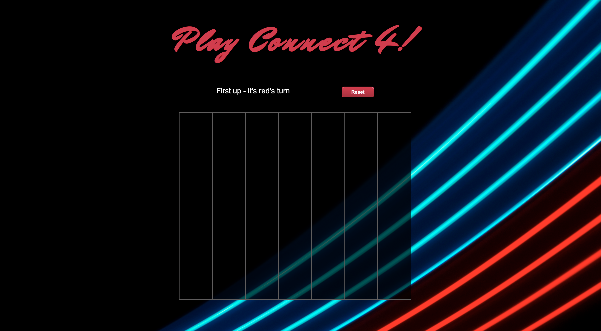

# Game Project

## Overview

Welcome to the readme for my first project at General Assembly. 

## Brief

To build a classic arcade game. We were given the following options:
- Battleships
- Connect 4
- Minesweeper
- Pacman
- Reversi
- Snake
- Tetris
- Ultimate Tic-Tac-Toe
- Frogger
- Space Invaders

I choose Connect 4, purely for nostalgia reasons! 

## Technologies
​
The app was built with:
​
* JavaScript
* HTML
* CSS
* Git
* Github

## Game Requirements

* The game should be playable for two players on the same computer, taking turns to make their moves
* The winner should be displayed when the game is over
* The game cannot be built with Canvas

## Deployment

You can play the game here: https://ckapak.github.io/sei-project-1/ 

## Getting Started

Clone or download the repo. Then open the index.html file in your browser to play the game. It should work in all browsers, including Chrome, Firefox, Safari and Opera.

## About Connect 4

Connect 4 is a game where players attempt to make a line of four pieces in a 7 x 6 grid. Players can drop their pieces into columns, so that their piece rests in the lowest available space in that column.

The winner is the first to create a line of four in any direction, including diagonally. If the board is filled before a line of 4 can be made, the game is declared a draw.

## Website Architecture

When the user opens the app, the game says that it's red counter's turn first. There is a reset button which, when clicked, clears the board and the game restarts. 



If the user hovers over a column and it's highlighted, it means that the column is available and the user is able to add a counter. But if the user hovers over a column and it doesn't highlight, it means that the column is unavailable and the user won't be able to add a counter. 

After the first counter is played, it's blue counter's turn. 


Eventually, as the game is played, it goes into three states:

### Win & Lose 

Blue counter wins which means red loses:


### Draw

There is a draw so there are no winners:


To restart the game, the user must click the reset button. 

## Wins & Key Learnings

It was a very tricky game to build! Most of the time it meant having to deleting huge chunks of code and there were times where I deleted everything! The key lesson I learnt from this project was not to be afraid of deleting, researching and testing - it teaches you great patience! Nevetheless I'm extremely proud of this game as it was my first project using JavaScript after three weeks at General Assembly. 

One of the main challenges were doing the diagonal checks. I managed to find a way of diagonally transposing the array of arrays then mapping and reversing it because the old array kept altering:

```
  checkBothDiagonal(grid) {
    const result = this.checkDiagonal(grid)
    if (result) {
      return result
    }
    const reversedTable = grid.map((r) => Array.from(r).reverse())
    return this.checkDiagonal(reversedTable)
  }

  checkDiagonal(grid) {
    const height = grid.length
    const width = grid[0].length
    
    for (let k = 0 ; k <= width + height - 2; k++) {
      const data = []
    
      for (let j = 0 ; j <= k; j++) {
        const i = k - j
        if (i < height && j < width) {
          data.push(grid[i][j])
        }
      }
    
      if (data.length >= 4) {
        // console.log(data)
        const result = this.checkForWin(data)
        if (result) {
          return result
        }
      }
    }
  }
```

Another win was making the counters smoothly "fall" into the available columns - I set a timeout where the counter went from becoming 'hidden' and then 'visible':

```
  addCounterElement(columnElement, columnIndex, color) {
    const div = document.createElement('div')
    div.classList.add('circle')
    div.classList.add(color)
    div.classList.add('hidden')
    columnElement.appendChild(div)
    setTimeout(() => div.classList.remove('hidden'), 0)
  }
```


## Future Improvements

With more time, I would like to make the game mobile responsive and have a single-player mode against the computer. 
